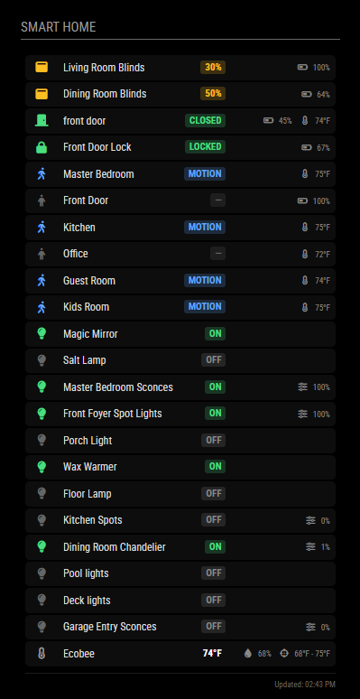

# MMM-STStatus

A MagicMirror² module that displays the status of your SmartThings devices in a clean, card-style interface.



## Features

- **OAuth authentication** - Automatic token refresh for long-term reliability
- **Room-based device selection** - Select devices by room name, not just capability
- **Explicit device list** - Or specify exact devices to display
- **Interactive setup script** - Easy configuration generation
- **Smart caching** - Faster startup and offline resilience
- **Rate limit aware** - Respects SmartThings API limits
- **Test mode** - Development and screenshots without API access
- **Responsive design** - Adapts to different display sizes

## Prerequisites

- [MagicMirror²](https://github.com/MichMich/MagicMirror) version 2.25.0 or later
- Node.js version 18.0.0 or later
- A [SmartThings](https://www.smartthings.com/) account with connected devices
- SmartThings OAuth credentials (recommended) or Personal Access Token

## Installation

1. Navigate to your MagicMirror modules folder:
   ```bash
   cd ~/MagicMirror/modules
   ```

2. Clone this repository:
   ```bash
   git clone https://github.com/YOUR_USERNAME/MMM-STStatus.git
   ```

3. Install dependencies:
   ```bash
   cd MMM-STStatus
   npm install
   ```

4. Set up authentication (see Authentication section below)

5. Configure the module in your `config/config.js`

## Authentication

MMM-STStatus supports two authentication methods:

### Option 1: OAuth (Recommended)

OAuth provides automatic token refresh and long-term reliability. Personal Access Tokens expire after 24 hours, making OAuth the preferred method for unattended displays.

#### Step 1: Install the SmartThings CLI

Download and install the SmartThings CLI from:
https://github.com/SmartThingsCommunity/smartthings-cli/releases

- **Windows**: Download and run the `.msi` installer
- **macOS**: `brew install smartthingscommunity/smartthings/smartthings`
- **Linux**: Download the appropriate binary from releases

After installation, verify it works:
```bash
smartthings --version
```

#### Step 2: Log into the CLI

Run any command to trigger the login flow:
```bash
smartthings devices
```

A browser window will open - log in with your Samsung account.

#### Step 3: Create an OAuth App

Run:
```bash
smartthings apps:create
```

When prompted, enter:
- **App type**: OAuth-In App
- **Display name**: `MMM-STStatus`
- **Description**: `MagicMirror SmartThings Status Display`
- **Icon image URL**: (leave blank, press Enter)
- **Target URL**: (leave blank, press Enter)
- **Scopes**: Select these permissions:
  - `r:devices:*` (read devices)
  - `x:devices:*` (execute device commands)
  - `r:locations:*` (read locations)
- **Redirect URIs**: `https://httpbin.org/get`

**Important**: Save the `OAuth Client Id` and `OAuth Client Secret` that are displayed at the end. You won't be able to see the secret again!

Example output:
```
OAuth Info (you will not be able to see the OAuth info again so please save it now!):
───────────────────────────────────────────────────────────
 OAuth Client Id      xxxxxxxx-xxxx-xxxx-xxxx-xxxxxxxxxxxx
 OAuth Client Secret  xxxxxxxx-xxxx-xxxx-xxxx-xxxxxxxxxxxx
───────────────────────────────────────────────────────────
```

#### Step 4: Run OAuth Setup

Navigate to the module directory and run the setup script:

```bash
cd ~/MagicMirror/modules/MMM-STStatus
node oauth-setup.js
```

The script will:
1. Ask for your Client ID and Client Secret
2. Display an authorization URL - open it in your browser
3. After granting permission, you'll be redirected to `httpbin.org/get` which displays JSON data
4. Copy the **full URL from your browser's address bar** (e.g., `https://httpbin.org/get?code=XXXXX&state=XXXXX`)
5. Paste the URL into the script
6. The script exchanges the code for tokens and saves them encrypted to `oauth-tokens.enc`

**Note**: Authorization codes expire within a few minutes and can only be used once. Complete the process promptly.

#### Step 5: Configure the Module

Add to your `config/config.js`:

```javascript
{
  module: "MMM-STStatus",
  position: "top_right",
  header: "Smart Home",
  config: {
    clientId: "YOUR_OAUTH_CLIENT_ID",
    clientSecret: "YOUR_OAUTH_CLIENT_SECRET",
    devices: [
      { id: "device-uuid-1", name: "Front Door" },
      { id: "device-uuid-2", name: "Thermostat" }
    ],
    pollInterval: 60000
  }
}
```

### Option 2: Personal Access Token (Legacy)

**Note**: As of December 30, 2024, new SmartThings PATs expire after 24 hours. This method requires periodic manual token regeneration and is not recommended for unattended displays.

1. Go to [https://account.smartthings.com/tokens](https://account.smartthings.com/tokens)
2. Log in with your Samsung account
3. Click **Generate new token**
4. Give it a name (e.g., "MagicMirror")
5. Select scopes:
   - `r:devices:*` - Read all devices
   - `r:locations:*` - Read all locations
6. Click **Generate token**
7. Copy the token immediately

Configure with:
```javascript
{
  module: "MMM-STStatus",
  position: "top_right",
  config: {
    token: "YOUR_SMARTTHINGS_PAT",
    devices: [...]
  }
}
```

## Configuration Options

| Option | Type | Default | Description |
|--------|------|---------|-------------|
| `clientId` | String | | OAuth Client ID (for OAuth auth) |
| `clientSecret` | String | | OAuth Client Secret (for OAuth auth) |
| `token` | String | | Personal Access Token (legacy auth) |
| `devices` | Array | `[]` | Explicit list of devices: `[{ id: "uuid", name: "Display Name" }]` |
| `rooms` | Array | `[]` | List of room names to include (e.g., `["Living Room"]`) |
| `pollInterval` | Number | `60000` | How often to fetch updates (ms, minimum 30000) |
| `showLastUpdated` | Boolean | `true` | Show "Updated: HH:MM" timestamp |
| `temperatureUnit` | String | `"F"` | Temperature unit: `"F"` or `"C"` |
| `defaultSort` | String | `"name"` | Sort by: `"name"`, `"room"`, or `"capability"` |
| `debug` | Boolean | `false` | Enable verbose console logging |
| `testMode` | Boolean | `false` | Use mock data (no API calls) |

## Supported Device Types

| Capability | Display | Icon |
|------------|---------|------|
| Switch | ON / OFF | 💡 Lightbulb |
| Contact Sensor | OPEN / CLOSED | 🚪 Door |
| Motion Sensor | MOTION / — | 🚶 Person |
| Lock | LOCKED / UNLOCKED | 🔒 Lock |
| Presence Sensor | HOME / AWAY | 🏠 House |
| Temperature | ##°F/°C | 🌡️ Thermometer |
| Humidity | ##% | 💧 Droplet |
| Battery | ##% | 🔋 Battery |
| Window Shade/Blinds | ##% | 🪟 Window |

### Thermostat Features

For thermostats (like Ecobee), the module displays:
- Current temperature (primary value)
- Humidity (secondary column)
- Heating/cooling setpoints (secondary column)
- Color-coded temperature based on operating state:
  - **Red**: Heating
  - **Blue**: Cooling
  - **Green**: Fan only
  - **White**: Idle

## Troubleshooting

### OAuth Setup Issues

#### "403 Forbidden" when visiting authorization URL
- Ensure the redirect URI in your SmartThings app matches exactly: `https://httpbin.org/get`
- Update the redirect URI using: `smartthings apps:oauth:update YOUR_APP_ID`

#### "Empty response from server (HTTP 401)" during token exchange
- This usually means the authorization code expired (they're valid for only a few minutes)
- Run `node oauth-setup.js` again and complete the browser authorization quickly

#### "OAuth tokens not found"
- Run `node oauth-setup.js` to set up OAuth
- Verify `oauth-tokens.enc` exists in the module directory
- Ensure `clientId` and `clientSecret` in config match the ones used during setup

#### "OAuth refresh token invalid"
- The refresh token may have been revoked or expired (30-day lifetime)
- Re-run `node oauth-setup.js` to get new tokens

### General Issues

#### "SmartThings authentication failed" (PAT mode)
- Your PAT may have expired (24-hour limit since Dec 30, 2024)
- Generate a new token or switch to OAuth

#### "No devices found"
- Room names must match exactly (case-sensitive)
- Verify devices are assigned to rooms in the SmartThings app
- Try using `testMode: true` to verify the module is loading

#### "Rate limit errors"
- Increase `pollInterval` to 120000 (2 minutes) or higher
- Reduce the number of devices being monitored
- The SmartThings API allows 250 requests per minute

#### Module not appearing
- Check the MagicMirror logs: `pm2 logs magicmirror` or `npm start dev`
- Verify the module is in the correct directory
- Ensure `npm install` completed successfully

#### Icons not showing
- Run `npm install` to ensure Font Awesome is installed
- Check browser console for CSS loading errors

## SmartThings API Limitations

MMM-STStatus relies on the SmartThings cloud API, which has known limitations outside the control of this module.

Users may occasionally experience:
- Intermittent API request failures or slow responses
- Temporary authentication errors (HTTP 401/403)
- Inconsistent capability payload structures across device types
- Delay in status updates (30-60 seconds typical)
- Short-term outages during SmartThings backend maintenance

To reduce impact, MMM-STStatus:
- Automatically refreshes OAuth tokens before expiration (every 20 hours)
- Caches the last known device state for continued display
- Uses defensive parsing to support multiple capability formats
- Implements exponential backoff on rate limit errors

## API Rate Limits

SmartThings limits API requests to **250 per minute** per token. This module:

- Tracks request count and warns at 200/minute
- Implements automatic backoff on rate limit errors
- Caches data to reduce unnecessary requests
- Uses a minimum poll interval of 30 seconds

For large installations (20+ devices), consider increasing `pollInterval` to 120000ms or higher.

## Security Notes

- OAuth tokens are encrypted using AES-256-GCM
- The encryption key is derived from your Client ID and Client Secret
- Token files can be safely synced via cloud storage (iCloud, Dropbox, etc.)
- Never commit `oauth-tokens.enc` or credentials to version control
- The `.gitignore` file excludes sensitive files by default

## File Structure

```
MMM-STStatus/
├── MMM-STStatus.js        # Frontend module
├── node_helper.js         # Backend helper (API, OAuth, caching)
├── oauth-setup.js         # One-time OAuth setup script
├── oauth-utils.js         # Token encryption utilities
├── oauth-tokens.enc       # Encrypted tokens (created by setup)
├── css/
│   └── MMM-STStatus.css   # Styles
├── package.json
├── README.md
└── .cache.json            # Device cache (auto-generated)
```

## Credits

- **MagicMirror²** - [https://magicmirror.builders/](https://magicmirror.builders/)
- **MMM-Smartthings** by buzzkc - Inspiration and prior art ([GitHub](https://github.com/buzzkc/MMM-Smartthings))
- **MMM-Ecobee** - UI design inspiration
- **SmartThings Community** - OAuth implementation guidance

## License

MIT License - see [LICENSE](LICENSE) for details.

## Contributing

Pull requests are welcome! Please:

1. Fork the repository
2. Create a feature branch
3. Make your changes
4. Test with `npm run lint`
5. Submit a pull request

## Support

- Open an [issue](../../issues) for bugs or feature requests
- Check existing issues before creating new ones
